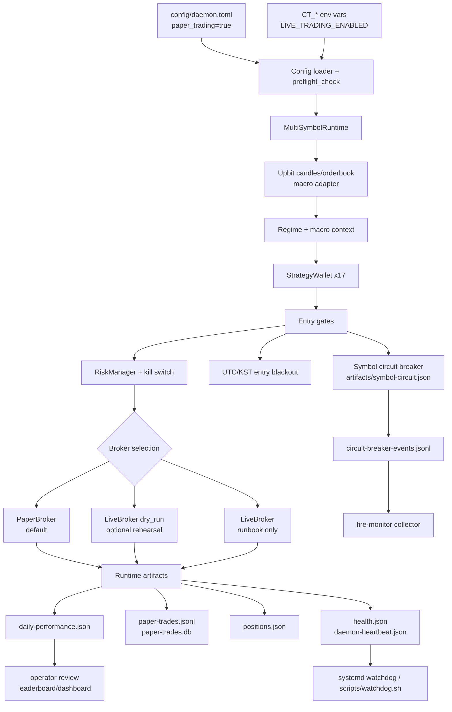

# Architecture

Current W11 architecture is a paper-first multi-wallet daemon with explicit
live-mode gates.

## Components

| Component | Responsibility | Operational surface |
|---|---|---|
| `config/daemon.toml` | Paper daemon config, active wallet inventory, risk overrides | Keep `paper_trading = true` by default |
| `src/crypto_trader/config.py` | TOML/env loading, hard live preflight, live confirmation checks | `scripts/preflight_live_check.py` |
| `src/crypto_trader/multi_runtime.py` | Main daemon loop, wallet orchestration, artifacts, auto-restart hooks | `scripts/restart_daemon.sh` |
| `src/crypto_trader/wallet.py` | Per-wallet signal gate, broker selection, symbol circuit integration | Wallet enable/disable workflow |
| `src/crypto_trader/risk/symbol_circuit_breaker.py` | Process-wide per-symbol cooldown on loss bursts or negative expectancy | `artifacts/symbol-circuit.json` |
| `src/crypto_trader/risk/kill_switch.py` | Portfolio/day/consecutive-loss stop logic | `artifacts/kill-switch.json` |
| `src/crypto_trader/macro/*` | Macro score/level/layer client and adapter | Macro sizing context |
| `scripts/preflight_live_check.py` | Human/JSON live readiness report | Pre-cutover only |
| `scripts/leaderboard.py` | Active wallet + realized/unrealized PnL view | Daily paper review |

## Runtime Flow

1. Load TOML and `CT_*` env overrides.
2. Run preflight checks. In paper, live gates are inert; in live, missing opt-in,
   stale confirmation, missing credentials, missing Telegram, or unsafe caps
   block startup.
3. Build 17 active wallets from non-commented `[[wallets]]` blocks.
4. Each tick fetches market data and macro/regime context.
5. Wallet strategies produce signals.
6. BUY signals pass through symbol circuit breaker, regime/macro gates, BTC
   stealth gate, entry blackout, risk manager, and execution-cost checks.
7. Paper or live broker executes according to global mode, credentials,
   `go_live_wallets`, and `live_dry_run`.
8. Runtime writes heartbeat, health, positions, trades, daily performance,
   circuit state, and operator reports.

## Safety Boundaries

- Paper-first: live is not the default and requires the migration runbook.
- Hard live caps remain policy: daily loss 5%, risk per trade 5%, position 10%.
- `go_live_wallets = []` means all wallets go live when `paper_trading = false`;
  therefore staged live promotion must use an explicit list.
- Symbol circuit breaker is process-wide by symbol, not per wallet.
- HMM volatility breakout exists for research but remains default-off after
  `0d5e4cd`.
